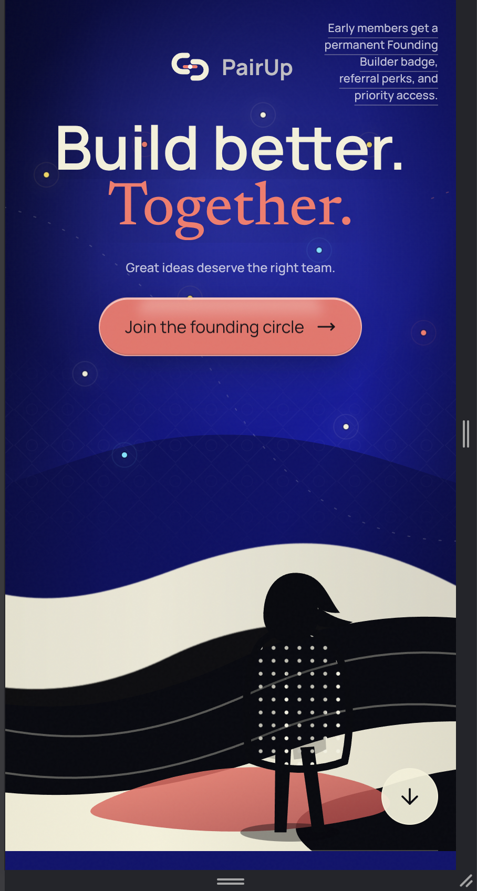

# PairUp Website Todo

## Current Implementation Pass

- [x] Replace the cluttered hero fly-ins with one ordered blur-and-opacity reveal.
- [x] Keep the hero terrain and builder stable from the first rendered frame.
- [x] Return the constellation field to one team at a time while preserving the faster cycle.
- [x] Fade and contract the collision network after the four profiles are accepted.
- [x] Move the final four profiles into a close orbit around the PairUp logo.
- [x] Keep each final profile overlap with the logo core between 10% and 15% on mobile, tablet, and desktop.
- [x] Give all seven swipe profiles real names.
- [x] Increase the accepted and rejected card edge glows without changing swipe direction.
- [x] Run two non-overlapping constellation teams at once and shorten the formation cycle by about 40%.
- [x] Keep the Chapter 4 skill pills looping continuously after Hardware.
- [x] Change the university activity line from cool people to amazing people.
- [x] Add a Vercel signup function that stores name and phone only.
- [x] Add normalized-phone duplicate handling and the Neon database schema.
- [x] Verify production build, desktop/mobile overflow, canvas activity, and marquee continuity.
- [x] Remove rejected generated SVGs, duplicate portrait sources, caches, and temporary test output.
- [ ] Reattach the requested Agrima portrait and identify its current owner before swapping.
- [ ] Connect Neon to the hosted Vercel project, run the schema, and verify a live database write.
- [ ] Choose the Founding Member badge collection before implementing the selector.

This checklist follows `websitedesign.md` in the same story order. It is the implementation source of truth.

## Working Rules

- [x] Build and review one chapter at a time.
- [x] Provide a live URL for review.
- [x] Do not provide screenshots.
- [x] Ask before adding or rewriting visible marketing copy.
- [x] Preserve the approved phone-number swipe card.
- [x] Keep signup to one phone or email field.
- [x] Do not ask role, year, programme, skills, goals, or referral questions on the landing page.
- [x] Keep the shared 28px radius for framed surfaces.
- [x] Keep PairUp as the product name.
- [ ] Mark a chapter complete only after browser, interaction, mobile, and reduced-motion checks.
- [ ] Do not start the next chapter until the current chapter is reviewed.

## User Overrides To Preserve

- [x] The pain statements behave as a clean vertical carousel.
- [x] Only one pain statement is sharp at a time.
- [x] The neighboring pain statement remains visible with blur instead of disappearing behind a divider.
- [x] Skill coverage includes frontend, backend, design, AI/ML, pitching, product, research, video/content, hardware, and related builder skills.
- [x] No real signup data exists yet.
- [ ] Use config-controlled demo momentum values for the pitch build.
- [ ] Before a public launch, replace demo momentum with real values or label it clearly as a demonstration.
- [x] Optional profile questions from the design document are deferred to post-signup onboarding.

# Site-Wide Story

- [ ] Present PairUp as the place where unfinished ideas meet the people needed to build them.
- [ ] Do not present PairUp as another networking platform.
- [ ] Begin with capable people who are isolated and scattered.
- [ ] Show the idea person, designer, developer, and presenter as separate signals.
- [ ] Move profiles, skills, and ideas closer together as the visitor scrolls.
- [ ] Turn separate signals into a team.
- [ ] Turn the team into visible momentum.
- [ ] End by inviting the visitor into the first circle.
- [ ] Preserve the emotional sequence: Alone -> Discovered -> Connected -> Building -> Belonging.
- [ ] Make the visitor briefly experience the feeling of finding their people.

# Chapter 1 - The Empty Space

## Content

- [ ] Open on a dark, spacious screen with very little visible.
- [ ] Show PairUp subtly above or beside the headline.
- [ ] Show: "Great ideas deserve the right team."
- [ ] After a short pause, show: "Build better. Together."
- [ ] Show: "the greatest ideas deserve the best team."
- [ ] Primary CTA: "Join the founding circle."
- [ ] Secondary line: "Early members get a permanent Founding Builder badge, referral perks, and priority access."
- [ ] Keep the first viewport focused enough to create anticipation.
- [ ] Ensure the first viewport still answers what PairUp is, who it is for, why it matters, and what to do next.

## Reference-Image Art Direction

- [ ] Match the supplied majestic blue editorial reference image.
- [ ] Use a full-bleed deep cobalt and ink night environment.
- [ ] Place sculptural black and bone topographic forms along the lower scene.
- [ ] Use tactile paper grain and printed texture.
- [ ] Use a lone human builder silhouette as the initial scale cue.
- [ ] Use sparse stars and signal points in the sky.
- [ ] Keep the scene cinematic, quiet, and slightly mysterious.
- [ ] Make the scene feel local through restrained Jaipur/Rajasthan geometry and material.
- [ ] Explore subtle jali linework, an abstract arid horizon, and sandstone/coral accents.
- [ ] Avoid monuments, tourist collages, fest-poster styling, and generic campus stock imagery.
- [ ] Keep hero art full-bleed and unframed.
- [ ] Keep all copy clear of the artwork.
- [ ] Leave a visible hint of Chapter 2 in every desktop and mobile first viewport.

## Motion

- [ ] Reveal headline letters with slight blur that sharpens into focus.
- [ ] Let background dots drift independently.
- [ ] Attract some dots subtly toward the pointer.
- [ ] Give the primary CTA a soft magnetic hover response.
- [ ] Keep entrance motion slow and restrained.
- [ ] Provide a complete reduced-motion composition.
- [ ] Keep the CTA usable before decorative motion finishes.

## Minimal Top Bar

- [ ] Do not build a traditional navbar.
- [ ] Use a minimal floating top bar containing PairUp and "Join early."
- [ ] Allow the top bar to become visible after the hero.
- [ ] Route "Join early" directly to the approved signup card.

## Chapter 1 Review

- [ ] Review at the live URL on desktop.
- [ ] Review at the live URL on mobile.
- [ ] Verify text fit and zero horizontal overflow.
- [ ] Verify the hero without animation.
- [ ] Verify CTA behavior.
- [ ] Run the production build.

# Chapter 2 - Everyone Is Looking For Someone

## Statements ()

- [ ] Show: "I have the idea. I need someone who can build it."
- [ ] Show: "I can code, but I need a designer."
- [ ] Show: "I want to join hackathons, but I never find the right team."
- [ ] Show: "I have skills. I just don't know the right people."
- [ ] Show: "I'm ready to build something beyond assignments."
- [ ] Make each statement feel like it belongs to a different student.
- [ ] Communicate: "You are not the only one struggling to find the right people."

## User-Requested Carousel

- [ ] Use a clean vertical carousel rather than five unrelated cards.
- [ ] Keep one statement sharp and primary at a time.
- [ ] Keep the next or previous statement visible but softly blurred.
- [ ] Move the current statement upward as the next one becomes active.
- [ ] Do not make inactive statements vanish behind a line.
- [ ] Keep all statements accessible without relying on animation.
- [ ] Define reduced-motion behavior as a readable stacked sequence.

## Skill Signals

- [ ] React.
- [ ] UI/UX.
- [ ] AI/ML.
- [ ] Pitching.
- [ ] Product.
- [ ] Research.
- [ ] Video.
- [ ] Hardware.
- [ ] Frontend.
- [ ] Backend.
- [ ] Mobile.
- [ ] Data.
- [ ] Content.
- [ ] Keep the skill system extensible without displaying every tag at once.

## Scene And Motion

- [ ] Make the section feel like many students are sending signals into the same space.
- [ ] Bring signals in from different edges.
- [ ] Let signals move independently at first.
- [ ] Reduce the distance between complementary signals as the visitor scrolls.
- [ ] Draw thin organic links between complementary skills.
- [ ] Connect Idea to Developer.
- [ ] Connect Developer to Designer.
- [ ] Connect Designer to Presenter.
- [ ] Avoid a technical network-diagram appearance.
- [ ] Carry the majestic night environment forward instead of switching to a generic light section.

## Compatible Pain Copy From The One-Page Brief

- [ ] Include "Have projects to build but no team?" where it supports the chapter.
- [ ] Include "Your friends are not interested." as a compatible signal or supporting line.
- [ ] Include "You need a designer, developer, or presenter." as a compatible signal or supporting line.
- [ ] Include the hackathon registration deadline frustration.
- [ ] Include the transition about discovering people by skills, interests, availability, and ambition.
- [ ] Ask before deciding the final visible combination of the two supplied copy sets.

## Chapter 2 Review

- [ ] Review carousel pacing at the live URL.
- [ ] Verify only one statement is primary at a time.
- [ ] Verify blurred neighboring content remains readable enough to imply continuity.
- [ ] Verify keyboard, touch, and reduced-motion behavior.
- [ ] Verify mobile reading order.
- [ ] Run the production build.

# Chapter 3 - The Collision

## Central Promise

- [ ] Show: "Your next great team may already be here."
- [ ] Ask before choosing whether the optional supporting line is visible.
- [ ] Make this the first clear moment where PairUp becomes the answer.
- [ ] Communicate momentum, not connection alone.

## Team Cluster

- [ ] Converge the scattered messages toward the centre.
- [ ] Increase environmental energy as profiles approach.
- [ ] Form a cluster of expressive profile cards.
- [ ] Include one developer.
- [ ] Include one designer.
- [ ] Include one product thinker.
- [ ] Include one presenter.
- [ ] Keep profiles fast and expressive rather than resume-like.

## Profile Information

- [ ] First name.
- [ ] University.
- [ ] Main skill.
- [ ] What the person wants to build.
- [ ] Availability status.
- [ ] Small personality signal.
- [ ] Use approved real profiles or clearly marked prototype data.
- [ ] Do not present invented profiles as real users.
- [ ] Use the Aarav and Meera examples only as internal visual fixtures unless approved for public display.
- [ ] Include statuses such as "Ready to build" and "Looking for a team."

## Motion

- [ ] Move individual profiles into orbit around a controlled luminous centre.
- [ ] Place the PairUp symbol at the centre.
- [ ] Send one quick pulse through the aligned network.
- [ ] Transition status from "Searching" to "Matched" to "Building."
- [ ] Make alignment one of the most satisfying page moments.
- [ ] Keep the glow controlled and avoid neon treatment.
- [ ] Provide a static completed-team reduced-motion state.

## Compatible How-It-Works Content

- [ ] Represent "Create your builder profile" within the forming profile cards.
- [ ] Represent skills, interests, preferred roles, and hackathon goals visually.
- [ ] Represent "Discover compatible teammates" through complementary-role attraction.
- [ ] Represent "Connect and start building" through the completed cluster.
- [ ] Avoid adding a separate speculative dashboard.
- [ ] Avoid building a full Tinder-style swipe deck.

## Chapter 3 Review

- [ ] Review convergence and orbit at the live URL.
- [ ] Verify the team composition is understandable without motion.
- [ ] Verify no profile text overflows.
- [ ] Verify mobile and reduced-motion states.
- [ ] Run the production build.

# Chapter 4 - The Place Is Already Moving

## Heading

- [ ] Use "Something is already forming." or "Builders are already showing up."
- [ ] Ask before choosing the final heading.

## Activity Stream

- [ ] Support: "A designer joined from Jaipur."
- [ ] Support: "Three AI builders are looking for a fourth teammate."
- [ ] Support: "A product idea in sustainability is looking for a developer."
- [ ] Support: "Someone reserved the username 'pixelpilot.'"
- [ ] Support: "Five new builders joined today."
- [ ] Treat these as configurable pitch/demo activity unless connected to real data.
- [ ] Replace or clearly label demo activity before public release.

## Momentum Numbers
- [ ] Support a config-controlled "active ideas" count.
- [ ] Support a config-controlled "universities represented" count.
- [ ] Support a config-controlled "teams forming" count.
- [ ] Use the design examples 248, 37, 12, and 68 only as demo fixtures.
- [ ] Keep all values in one typed configuration file.
- [ ] Replace demo values with real data when available.
- [ ] Avoid layout shift when values change.

## Visual Style

- [ ] Make PairUp feel alive rather than like an empty pre-launch platform.
- [ ] Build a living digital-city signal field, not a traditional analytics dashboard.
- [ ] Let activity messages enter, leave, and rearrange.
- [ ] Use small profile or avatar circles moving through the scene.
- [ ] Let skill tags flow continuously.
- [ ] Keep the activity integrated with the cinematic environment.

## Motion

- [ ] Count numbers upward when the chapter enters.
- [ ] Slide activity messages gently into a queue.
- [ ] Light profile circles one by one.
- [ ] Let a thin line travel between university labels.
- [ ] Suggest that PairUp continues operating when the visitor is not interacting.
- [ ] Keep motion calm enough for scanning.
- [ ] Provide a static reduced-motion queue.

## Chapter 4 Review

- [ ] Review the live-looking activity at the live URL.
- [ ] Verify demo values are isolated in configuration.
- [ ] Verify the scene does not resemble a dashboard template.
- [ ] Verify mobile and reduced-motion states.
- [ ] Run the production build.

# Chapter 5 - Build Anything

## Main Copy

- [ ] Show: "Not every great team begins with a competition."
- [ ] Show: "Build the startup. Ship the side project. Enter the hackathon. Launch the club. Make the film. Start the research."
- [ ] Show: "Whatever you want to make, you should not have to build it alone."
- [ ] Establish PairUp as a campus collaboration layer, not only a hackathon finder.

## Visual Worlds

### Hackathons

- [ ] Show: "Find complementary skills before registration closes."
- [ ] Begin with a hackathon timer visual.

### Startups

- [ ] Show: "Meet people who want to build beyond the idea stage."
- [ ] Transform the timer into a product screen.

### Side Projects

- [ ] Show: "Turn saved notes and unfinished prototypes into something real."
- [ ] Include unfinished-note or prototype language in the visual world.

### Research

- [ ] Show: "Find collaborators with different technical and academic strengths."
- [ ] Transform the product screen into a research board.

### Creative Work

- [ ] Show: "Form teams for films, design projects, content, or campus initiatives."
- [ ] Transform the research board into a film frame.

## Motion

- [ ] Move through distinct visual environments during scroll.
- [ ] Transform one world into the next rather than showing a generic card grid.
- [ ] Collapse all worlds into the same final shape: people building together.
- [ ] Keep the section comprehensive without becoming long or heavy.
- [ ] Provide a readable non-pinned mobile fallback.
- [ ] Provide a static reduced-motion sequence.

## Chapter 5 Review

- [ ] Review world transitions at the live URL.
- [ ] Verify all five possibilities are represented.
- [ ] Verify the page still feels like one visual story.
- [ ] Verify mobile and reduced-motion states.
- [ ] Run the production build.

# Chapter 6 - The Founding Circle

## Main Copy

- [ ] Centre a premium badge.
- [ ] Title: "Founding Builder."
- [ ] Supporting copy: "For the people who joined before PairUp became obvious."
- [ ] Small line: "Available only during the pre-launch phase."
- [ ] Make the emotional trigger feel like early identity and status.

## Perks

- [ ] Permanent Founding Builder badge.
- [ ] Priority access when matching opens.
- [ ] Early profile visibility.
- [ ] Reserved username.
- [ ] Access to the founding community.
- [ ] Voting access for early features.
- [ ] Referral unlocks.
- [ ] Invitations to private team-forming sessions.
- [ ] Confirm operationally real perks before public release.

## Badge Art

- [ ] Make the badge premium rather than a cheap gamification icon.
- [ ] Use metallic, iridescent, or glass-like material.
- [ ] Combine violet, cyan, silver, and a slight warm highlight.
- [ ] Rotate the badge very slowly.
- [ ] Let pointer position affect badge lighting.
- [ ] Surround the badge with approved real initials or omit them.
- [ ] Do not invent member initials and present them as real.
- [ ] Calm the page motion as this chapter begins.
- [ ] Preserve a composed reduced-motion badge state.

## Compatible Identity Values

- [ ] Weave "For students who would rather build than wait" into this chapter or Chapter 5 only after copy approval.
- [ ] Preserve Curiosity over credentials.
- [ ] Preserve Collaboration over cliques.
- [ ] Preserve Action over endless planning.
- [ ] Preserve Skills over popularity.
- [ ] Preserve People over profiles.
- [ ] Integrate values editorially without adding a generic feature-card section.

## Chapter 6 Review

- [ ] Review badge material and lighting at the live URL.
- [ ] Verify all displayed perks are deliverable or clearly prototype-only.
- [ ] Verify the badge does not look like crypto artwork.
- [ ] Verify mobile and reduced-motion states.
- [ ] Run the production build.

# Chapter 7 - Referral Loop

## Main Copy

- [ ] Heading: "The best teams usually begin with one introduction."
- [ ] Supporting line: "Join PairUp, receive your personal link, and invite people you would want in the network."
- [ ] Use "verified referrals" rather than only "referrals."
- [ ] Reinforce trusted university-network growth.
- [ ] Keep the system meaningful rather than transactional.

## Unlock Tiers

- [ ] Join: Founding Builder badge.
- [ ] 2 verified referrals: Priority access.
- [ ] 5 verified referrals: Profile boost at launch.
- [ ] 10 verified referrals: Community Builder badge.
- [ ] 20 verified referrals: Founding ambassador access.
- [ ] Confirm that each reward can be delivered before public display.
- [ ] Track activated verified referrals rather than submitted contacts.
- [ ] Prevent self-referrals and low-quality spam.

## Motion

- [ ] Reveal a personal referral link.
- [ ] Branch the link outward as a network.
- [ ] Add one node for each verified referral.
- [ ] Unlock perks visually as the network grows.
- [ ] Do not use a generic progress bar.
- [ ] Keep signup valid if referral services fail.
- [ ] Provide a static reduced-motion referral tree.

## Chapter 7 Review

- [ ] Review the branching network at the live URL.
- [ ] Verify tier wording matches the design document.
- [ ] Verify all data-dependent states have safe fallbacks.
- [ ] Verify mobile and reduced-motion states.
- [ ] Run the production build.

# Chapter 8 - The Final Invitation

## Main Screen

- [ ] Slow the previous motion down.
- [ ] Connect all earlier people and signals in the background.
- [ ] Main option: "Your next team starts with one signup."
- [ ] Alternative: "The right people are showing up. Be one of them."
- [ ] Ask before choosing the final main line.
- [ ] Place the approved signup card centrally.
- [ ] Initially show one field only.
- [ ] Decide whether the one field accepts phone only or both phone and university email.
- [ ] Final CTA: "Claim my Founding Builder badge."
- [ ] Under-button line: "Free to join. Takes less than 20 seconds."
- [ ] Verify the timing claim before public use.
- [ ] Make signup feel like entering something rather than submitting a form.

## Preserved Swipe Card

- [x] Premium profile-card design.
- [x] Phone-number field.
- [x] Swipe right to join.
- [x] Arrow-button completion.
- [x] Scroll-entry rightward hint.
- [x] Invalid-number recovery.
- [x] Mobile fit without horizontal overflow.
- [ ] Integrate it into the connected final network without redesigning its approved core.
- [ ] Connect every primary CTA to this card.

## Optional Profile Pills From The Design Document

- [x] Do not show optional role or project pills on the landing page.
- [ ] Defer "What do you bring?" to later product onboarding.
- [ ] Defer Development, Design, AI/ML, Product, Research, Pitching, Content, Hardware, and Still exploring.
- [ ] Defer "What are you looking to build?" to later product onboarding.
- [ ] Defer Hackathon team, Startup, Side project, Research, Creative project, and Anything interesting.
- [ ] Preserve these options in the future onboarding specification.

## After Signup

- [ ] Decide between "You're in. Welcome to the founding circle." and the approved "You're officially a Founding Builder."
- [ ] Ask before changing the visible success line.
- [ ] Show a badge preview.
- [ ] Show a real personal referral link when available.
- [ ] Show a real current referral count when available.
- [ ] Show the real next unlock when available.
- [ ] Add a share button.
- [ ] Add a copy-link button.
- [ ] Support: "Invite 2 verified builders to unlock priority access."
- [ ] Hide unavailable referral data instead of inventing it.
- [ ] Preserve successful signup if referral data fails.

## Chapter 8 Review

- [ ] Review the complete signup path at the live URL.
- [ ] Test swipe, click, Enter, keyboard, and reduced-motion completion.
- [ ] Test invalid, duplicate, offline, server-error, and retry states.
- [ ] Verify no qualifying questions appear.
- [ ] Verify mobile and reduced-motion states.
- [ ] Run the production build.

# Visual Direction

## Required Mood

- [ ] Cinematic.
- [ ] Youthful.
- [ ] Intelligent.
- [ ] Premium.
- [ ] Social.
- [ ] Energetic.
- [ ] Slightly futuristic.

## Must Not Feel

- [ ] Corporate.
- [ ] Like a college portal.
- [ ] Like a generic SaaS template.
- [ ] Overly playful.
- [ ] Like a crypto project.
- [ ] Like a traditional networking website.
- [ ] Like a cheap campus event poster.
- [ ] Like neon AI-generated artwork.

## Exact Palette

- [ ] Base deep black-blue: #070912.
- [ ] Primary electric violet: #7B61FF.
- [ ] Human accent warm coral: #FF6B6B.
- [ ] Secondary signal cyan: #5DE4FF.
- [ ] Primary text: #F7F7FB.
- [ ] Secondary text: #A7A9B8.
- [ ] Badge: violet, cyan, silver, and a slight warm highlight.
- [ ] Reconcile the current coral token with #FF6B6B while preserving the approved swipe-card composition.
- [ ] Keep violet and cyan controlled so the page does not become neon or one-note.
- [ ] Use black and bone terrain to balance the cobalt environment.

# Typography

- [ ] Use large, confident editorial typography.
- [ ] Do not make headlines feel like software documentation.
- [ ] Use a very large display face for major statements.
- [ ] Use a clean sans-serif for paragraphs and interface elements.
- [ ] Use monospace only for live signals, referral codes, and status labels.
- [ ] Keep headlines short.
- [ ] Support: "Build better. Together."
- [ ] Support: "Everyone is looking for someone."
- [ ] Support: "Something is already forming."
- [ ] Support: "Build anything."
- [ ] Support: "Join the founding circle."
- [ ] Do not scale font size continuously with viewport width.
- [ ] Verify every long word and CTA fits its container.

# Motion Language

- [ ] Use motion to tell the story rather than only to impress.
- [ ] Separation: objects move independently at the beginning.
- [ ] Attraction: complementary elements pull together during scroll.
- [ ] Connection: lines, pulses, and orbiting represent discovery.
- [ ] Acceleration: the middle becomes faster as teams form.
- [ ] Belonging: the ending becomes stable and coordinated.
- [ ] Make everything that moved separately eventually move as one system.
- [ ] Keep motion readable and performant.
- [ ] Define a meaningful reduced-motion equivalent for every chapter.

# GSAP Implementation

## ScrollTrigger

- [ ] Treat each chapter as one scroll scene.
- [ ] Pin only scenes that need time to communicate.
- [ ] Keep the hero fixed while isolated dots appear when appropriate.
- [ ] Converge profile cards through the Chapter 3 scroll scene.
- [ ] Count activity numbers when Chapter 4 enters.
- [ ] Rotate and reveal Founding Builder perks in Chapter 6.
- [ ] Settle the final network behind the signup in Chapter 8.
- [ ] Avoid excessive pinning on mobile.

## Timelines

- [ ] Use one GSAP timeline per chapter.
- [ ] Coordinate text entrances.
- [ ] Coordinate card movement.
- [ ] Coordinate blur changes.
- [ ] Coordinate scale and opacity.
- [ ] Coordinate connection lines.
- [ ] Coordinate background lighting.
- [ ] Coordinate chapter transitions.
- [ ] Prevent chapters from feeling like unrelated animation demos.

## Pointer Interaction

- [ ] Magnetic CTA.
- [ ] Subtle profile-card tilt.
- [ ] Badge lighting follows pointer.
- [ ] Background particles attract toward pointer.
- [ ] Skill pills contain subtle internal motion.
- [ ] Disable pointer-only effects where hover is unavailable.

## Text Motion

- [ ] Use restrained word-by-word or line-by-line reveals.
- [ ] Use blur-to-sharp where specified.
- [ ] Emphasize ideas, team, together, and building where appropriate.
- [ ] Do not hide essential copy until long animations complete.

# Technical Structure

- [x] React.
- [x] Vite.
- [x] GSAP.
- [x] GSAP ScrollTrigger.
- [x] Motion for small interface transitions.
- [x] Lenis smooth scrolling.
- [x] CSS variables and Tailwind theme tokens.
- [ ] GSAP owns cinematic chapter timelines.
- [ ] Motion owns form-state changes, success confirmation, and small UI transitions.
- [ ] Prevent GSAP and Motion from controlling the same transform layer.
- [ ] Add Supabase or Firebase later for lead storage.
- [ ] Add a lightweight API later for referral creation.
- [ ] Keep decorative systems lazy-loaded.
- [ ] Keep signup usable before decorative code loads.
- [ ] Use shaders or WebGL only after measuring visual gain and performance cost.
- [ ] Remove unused Three.js code and dependency if the final design does not need it.

# Exact Page Structure

- [ ] 1. Hero.
- [ ] 2. Scattered builder signals.
- [ ] 3. Team collision.
- [ ] 4. Live activity and social momentum.
- [ ] 5. Build-anything possibilities.
- [ ] 6. Founding Builder badge.
- [ ] 7. Referral perks.
- [ ] 8. Final signup.
- [ ] 9. Signup success and referral state.
- [ ] Do not add a traditional navbar.
- [ ] Do not add extra standalone sections unless approved.
- [ ] Weave compatible how-it-works and values content into these chapters rather than changing the page order.

# Copy Direction

- [ ] Keep language short, confident, and human.
- [ ] Avoid: "Connect with like-minded individuals."
- [ ] Use: "Meet people who want to build."
- [ ] Avoid: "Create your profile and explore collaboration opportunities."
- [ ] Use: "Show what you bring. Find what you're missing."
- [ ] Avoid: "Join our growing community."
- [ ] Use: "The first builders are already here."
- [ ] Avoid: "Get early access."
- [ ] Use: "Join the founding circle."
- [ ] Ask before choosing between alternatives or introducing new visible lines.

# Final Emotional Outcome

By the signup, the visitor should feel:

- [ ] I am not the only person searching.
- [ ] There are talented people around me.
- [ ] This could help me finally start something.
- [ ] The network already feels active.
- [ ] Joining early gives me status and access.
- [ ] Signing up takes almost no effort.
- [ ] I want to see who else is here.
- [ ] The page made me feel the promise instead of merely explaining it.

# Final QA

- [x] Enlarge and tighten the final four-profile orbit on desktop and mobile, with about 15% overlap against the PairUp core.
- [x] Expand pre-launch proof into three honest signals, including a hand-drawn coral underline for "ziddis."

## Visual

- [ ] Review each completed chapter through the live URL only.
- [ ] Desktop wide viewport.
- [ ] Desktop standard viewport.
- [ ] Tablet portrait and landscape.
- [ ] Mobile 390px.
- [ ] Mobile 320px.
- [ ] Short-height mobile.
- [ ] Zero horizontal overflow.
- [ ] No incoherent overlap.
- [ ] Stable artwork framing.
- [ ] Next-chapter hint in the hero.
- [ ] One majestic visual system from isolation to belonging.

## Accessibility

- [ ] Semantic heading order.
- [ ] Keyboard navigation.
- [ ] Visible focus.
- [ ] Sufficient contrast.
- [ ] Reduced-motion behavior.
- [ ] Form labels and errors.
- [ ] Status announcements.
- [ ] Touch targets.
- [ ] No essential meaning conveyed only by color or motion.

## Functional

- [ ] Every top-bar action.
- [ ] Every CTA.
- [ ] Valid signup.
- [ ] Invalid signup.
- [ ] Duplicate signup.
- [ ] Network failure and retry.
- [ ] Swipe, click, Enter, and keyboard completion.
- [ ] Referral fallbacks.
- [ ] No browser errors.

## Performance

- [ ] Production build.
- [ ] Initial JavaScript review.
- [ ] CSS size review.
- [ ] Lazy-load noncritical visuals.
- [ ] No blank canvas.
- [ ] No layout shift.
- [ ] Stable mobile animation.
- [ ] Local fonts load efficiently.
- [ ] Signup works before decorative systems finish.

# Build Order

- [ ] 0. Approve chapter copy choices and data/demo policy.
- [ ] 1. The Empty Space.
- [ ] 2. Everyone Is Looking For Someone.
- [ ] 3. The Collision.
- [ ] 4. The Place Is Already Moving.
- [ ] 5. Build Anything.
- [ ] 6. The Founding Circle.
- [ ] 7. Referral Loop.
- [ ] 8. The Final Invitation.
- [ ] 9. Signup Success And Referral State.
- [ ] 10. Final integration, cleanup, and launch QA.
